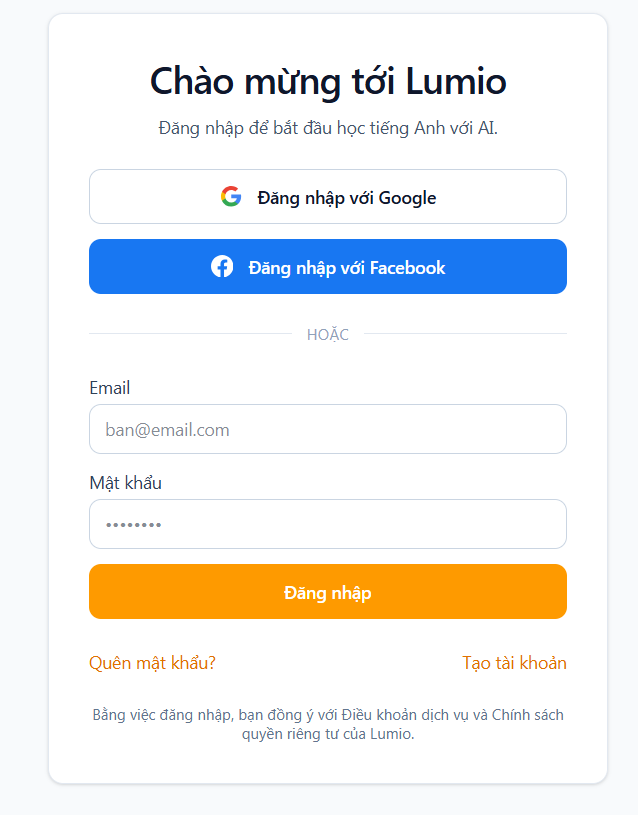
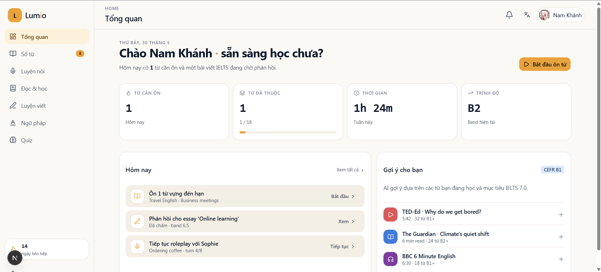
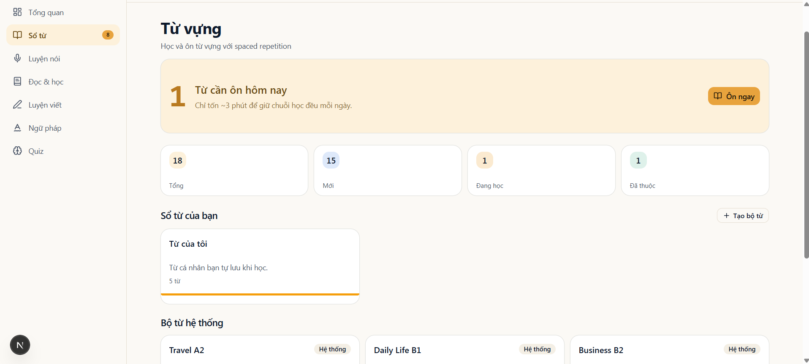
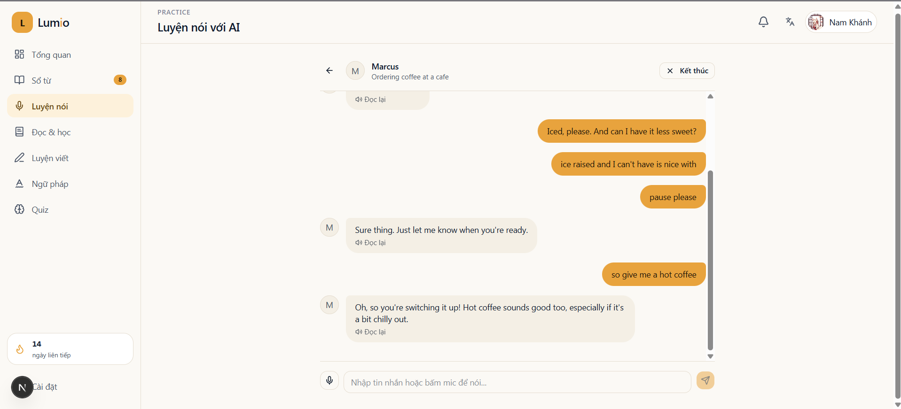
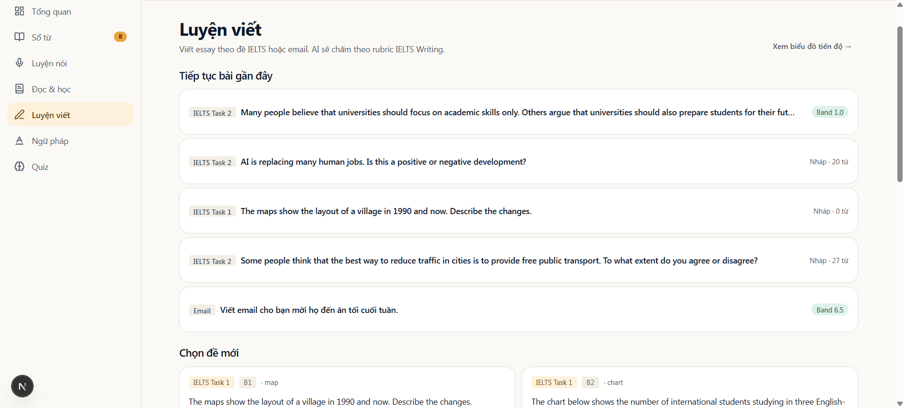

<p align="center">
  
</p>

<h1 align="center">Lumio — Học tiếng Anh ứng dụng AI cho người Việt</h1>

<p align="center">
  Nền tảng học tiếng Anh cá nhân hoá cho người Việt: nhớ từ với spaced repetition,
  luyện nói qua roleplay AI, đọc bài có gợi ý, và viết nhận phản hồi từng câu.
  Mọi tương tác đều bằng tiếng Việt, gọi bạn là <em>bạn</em> — không áp lực, không khẩu hiệu.
</p>

<p align="center">
  <a href="https://lumio.nguyenhoangnamkhanh.id.vn">Bản chạy trực tiếp</a>
  ·
  <a href="CLAUDE.md">Hướng dẫn cho AI agent</a>
  ·
  <a href="AGENTS.md">Quy ước code</a>
</p>

---

## Một thoáng giao diện

| | |
| --- | --- |
|  |  |
| Trang đăng nhập với theme ấm | Bảng điều khiển — tổng quan tiến độ |
|  |  |
| Bộ từ và lịch ôn tập SRS | Luyện nói qua nhân vật AI |

<p align="center">
  
</p>
<p align="center"><em>Luyện viết — phản hồi từng câu, gắn nhãn lỗi ngữ pháp và gợi ý cải thiện.</em></p>

---

## Tính năng chính

- **Bộ từ + SRS.** Tạo deck riêng, lưu từ khi đọc, ôn tập theo thuật toán SM-2. Hệ thống gợi ý lượng vừa đủ mỗi ngày để bạn không bỏ cuộc.
- **Đọc thông minh.** Dán URL bài báo hoặc YouTube, Lumio trích nội dung và đề xuất nguồn phù hợp với trình độ. Bấm vào từ lạ để xem nghĩa, lưu vào deck.
- **Luyện nói AI roleplay.** Chọn nhân vật (lễ tân, bạn cũ, phỏng vấn IELTS…) và bắt đầu hội thoại bằng giọng. Lumio chấm phát âm theo từng câu, đề xuất câu thay thế tự nhiên hơn.
- **Luyện viết có phản hồi.** Đề bài theo CEFR/IELTS, mỗi bài viết được chú thích từng câu: ngữ pháp, từ vựng, cấu trúc — kèm điểm gợi ý.
- **Ngữ pháp + Quiz.** Mini-quiz củng cố điểm yếu sau mỗi phiên học, không nhồi lý thuyết.
- **Bài kiểm tra trình độ đầu vào.** Đánh giá CEFR ban đầu để cá nhân hoá lộ trình.
- **Onboarding mượt.** 3 bước: mục tiêu, sở thích, placement test — chưa đến 5 phút.
- **Thông báo nhắc ôn.** Đẩy thông báo theo lịch SRS, không spam.

## Stack công nghệ

| Lớp | Công nghệ |
| --- | --- |
| Framework | [Next.js 16.2.6](https://nextjs.org) (App Router, Server Components, Server Actions, Turbopack) |
| Ngôn ngữ | TypeScript 5 (strict, `noUncheckedIndexedAccess`) |
| UI | React 19.2.4, Tailwind CSS v4, [shadcn/ui](https://ui.shadcn.com), [Base UI](https://base-ui.com), Radix, lucide-react |
| Form & validate | react-hook-form 7 + Zod 4 |
| Backend | [Supabase](https://supabase.com) — Postgres + Auth + Storage + Realtime, RLS là tầng auth chính |
| AI | [`@google/genai`](https://github.com/googleapis/js-genai) → Gemini 3.x; fallback OpenRouter |
| Speech | Google Cloud Speech-to-Text + Text-to-Speech |
| State | Zustand 5 (chỉ cho UI state nhỏ) |
| i18n | next-intl 4 (vi mặc định) |
| Rate limit | Upstash Redis + Ratelimit |
| Test | Playwright 1.60 (E2E) |

Quy ước nội bộ:

- Mặc định Server Component, chỉ `'use client'` khi cần state/effect/browser API.
- Mọi mutation đi qua Server Action, input wrap bằng Zod, gọi `revalidateTag/Path`.
- Repository pattern: `lib/repositories/<entity>.repo.ts` nhận `supabase` làm tham số, tin RLS.
- LLM call duy nhất qua `lib/ai/provider.ts` → `llm()` — không import SDK trực tiếp.

## Cấu trúc thư mục

```
src/
├── app/                    # App Router: (app)/, (auth)/, (marketing)/, api/
├── components/             # ui/ (shadcn primitives) + app/ (domain components)
├── lib/
│   ├── ai/                 # Prompt builders, llm() provider
│   ├── content/            # Trích nội dung URL/YouTube
│   ├── repositories/       # Tầng truy cập DB
│   ├── schemas/            # Zod schemas
│   ├── speaking/           # Persona config, scoring
│   ├── speech/             # Wrapper Google Cloud STT/TTS
│   ├── srs/                # Thuật toán SM-2
│   └── supabase/           # Client/server helpers (@supabase/ssr)
├── i18n/                   # next-intl config
├── proxy.ts                # Next 16 proxy (thay middleware.ts cũ)
└── types/                  # supabase.ts (types gen từ DB)
```

## Yêu cầu môi trường

- Node ≥ 20
- pnpm 9.15.0 (ghim trong `package.json`)
- [Supabase CLI](https://supabase.com/docs/guides/cli) (chạy DB local)
- (Tuỳ chọn) Google Cloud credentials JSON cho Speech/TTS — không bật vẫn chạy được phần còn lại

## Cài đặt và chạy local

```bash
# 1. Cài dependency
pnpm install

# 2. Chuẩn bị biến môi trường
cp .env.example .env.local
# Mở .env.local và điền các key cần thiết (xem nhóm bên dưới)

# 3. Khởi động Supabase local + apply migrations + seed
pnpm supabase:start
pnpm supabase:reset

# 4. Chạy dev server
pnpm dev
```

Mở [http://localhost:3000](http://localhost:3000).

### Biến môi trường

Bắt buộc:

- `NEXT_PUBLIC_SITE_URL`, `NEXT_PUBLIC_SUPABASE_URL`, `NEXT_PUBLIC_SUPABASE_ANON_KEY`
- `SUPABASE_SERVICE_ROLE_KEY` (chỉ dùng trong route `app/api/cron/*`)
- `GEMINI_API_KEY` *hoặc* `OPENROUTER_API_KEY` (ít nhất một để AI hoạt động)

Tuỳ chọn:

- `GOOGLE_CLOUD_PROJECT_ID`, `GOOGLE_CLOUD_CREDENTIALS_JSON`, `GOOGLE_CLOUD_ST_ENABLED`, `GOOGLE_CLOUD_TS_ENABLED` — bật STT/TTS
- `UPSTASH_REDIS_REST_URL`, `UPSTASH_REDIS_REST_TOKEN` — rate limit endpoint AI
- `SUPABASE_AUTH_GOOGLE_CLIENT_ID/SECRET`, `SUPABASE_AUTH_FACEBOOK_CLIENT_ID/SECRET` — đăng nhập social
- `CRON_SECRET` — gọi cron endpoint
- `SENTRY_DSN` — ghi log lỗi production

## Scripts

| Lệnh | Mục đích |
| --- | --- |
| `pnpm dev` | Dev server tại cổng 3000 (Turbopack) |
| `pnpm build` | Build production |
| `pnpm start` | Chạy production build cục bộ |
| `pnpm lint` | ESLint trên `src/` |
| `pnpm typecheck` | `tsc --noEmit` |
| `pnpm supabase:start` / `:stop` | Quản lý Supabase local container |
| `pnpm supabase:reset` | Reset DB + apply migrations + seed |
| `pnpm supabase:diff` | Sinh migration từ schema thay đổi |
| `pnpm supabase:push` | Push migration lên Supabase remote |
| `pnpm supabase:types` | Sinh `src/types/supabase.ts` |

## CI/CD

Ba workflow trong [.github/workflows/](.github/workflows/):

- **`ci.yml`** — chạy mỗi PR và push (trừ `main`): `pnpm typecheck` + `pnpm lint` + `pnpm build` trên Node 22.
- **`db-verify.yml`** — chạy khi PR đụng `supabase/migrations/**`: dựng Supabase local, apply toàn bộ migration + seed, chạy smoke SQL test.
- **`db-push.yml`** — manual dispatch: push migration lên Supabase staging/production, hỗ trợ dry-run trước.

Production tự động deploy lên Vercel khi merge vào `main`.

## Database

19 migration trong [supabase/migrations/](supabase/migrations/). Schema dùng tên tiếng Việt — gần với ngôn ngữ nghiệp vụ:

| Bảng | Vai trò |
| --- | --- |
| `ho_so` | Hồ sơ người dùng |
| `muc_tieu_nd` | Mục tiêu học của người dùng |
| `bai_kiem_tra_trinh_do`, `cau_hoi_kiem_tra` | Placement test và câu hỏi |
| `nhan_vat` | Nhân vật AI roleplay |
| `phien_noi`, `luot_noi` | Phiên nói và từng lượt nói |
| `nguon_noi_dung`, `doan_noi_dung` | Bài đọc và đoạn |
| `bo_tu`, `tu_da_luu`, `cau_hoi_tu_vung` | Bộ từ, từ đã lưu, quiz từ vựng |
| `lich_on_tap` | Lịch ôn theo thuật toán SRS |
| `de_bai_viet`, `bai_viet`, `chu_thich_bai_viet` | Đề bài viết, bài, chú thích phản hồi |
| `thong_bao` | Thông báo |
| `phien_hoc` | Log phiên học để dựng dashboard |

Extensions Postgres: `uuid-ossp`, `pgvector`, `pg_cron`, `pg_trgm`, `pg_jsonschema`. RLS bật trên 100% bảng `public.*` user-owned, mỗi bảng có 4 policy (select / insert / update / delete).

## Tài liệu nội bộ

- [CLAUDE.md](CLAUDE.md) — entry point cho AI agent (model, thinking, quy ước).
- [AGENTS.md](AGENTS.md) — quy ước code rút gọn (must-know).
- `docs/` — docs chi tiết (gitignore, chỉ local hoặc xem trong skill bundle [.claude/skills/lumio-design/](.claude/skills/lumio-design/)).

## Đóng góp

- Luôn làm việc trên feature branch — **không push thẳng `main`**.
- Conventional Commits tiếng Việt: `feat(vocab): thêm bộ đếm realtime`, `fix(ui): sửa layout review`.
- 1 commit = 1 ý. Mở PR vào `main` để CI chạy đầy đủ trước khi merge.

## Giấy phép

Dự án phục vụ bài cá nhân môn *Công nghệ mới phát triển phần mềm*. Liên hệ tác giả trước khi tái sử dụng cho mục đích thương mại.
